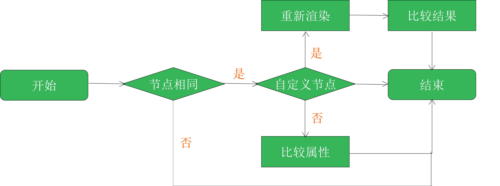
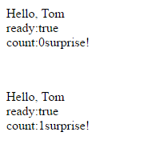
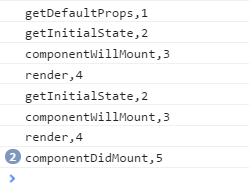
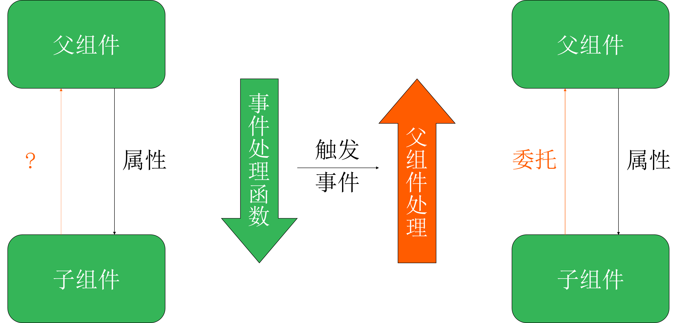

##React是什么
1. facebook 2013 发布
2. React 兼容IE8+

## Html Template
React官网提供的Html模板，所有demo都是在这个Html模板内编写的
```html
<!DOCTYPE html>
<html>

<head>
    <meta charset="UTF-8" />
    <title>Hello React!</title>
    <script src="../build/react.js"></script>
    <script src="../build/react-dom.js"></script>
    <script src="../build/browser.min.js"></script>
</head>

<body>
    <div id="example"></div>
    <script type="text/babel">
        // ** Our code goes here! **
        // 在这里书写jsx代码
    </script>
</body>
</html>
```
上面的html模板有几个地方要注意：
 * 要在`head`便签中引入`react.js`、`react-dom.js`、`browser.min.js`三个js库,而且要在jsx代码前引入，其中，`react.js` 是 React 的核心库，`react-dom.js` 是提供与 DOM 相关的功能，`Browser.js` 的作用是将 JSX 语法转为 JavaScript语法，这一步很消耗时间，实际上线的时候，应该使用构建工具构建完成后在放到服务器中。
 * 因为 React 独有的 JSX 语法，跟 JavaScript 不兼容。凡是使用 JSX 的地方，都要加上 `type="text/babel"`,所以`body`中的 `<script>` 标签的 `type` 属性为 `text/babel`。

## HelloWord 
官网提供了一个非常简单的HelloWord 的代码，将如下嵌入html模板中即可:
```javascript
<script type="text/babel">
      ReactDOM.render(
        <h1>Hello, world!</h1>,
        document.getElementById('example')
      );
    </script>
```
上面代码是将一个`h1`便签，插入`id`为`example`的dom节点下（查看代码 [helloword](http://facebook.github.io/react/docs/displaying-data.html#jsx-syntax) ）
## JSX
#### 什么是JSX
   * JSX=JavaScript XML
   * 是基于ECMAScript的一种新特性
   * 一种定义带属性结构的语法
   * JSX不是XML或者HTML,而是一种机制

#### JSX的特点
   * 类XML语法容易接受
   * 结构清晰
   * 增强js语义
   * 抽象程度高（跨平台）
   * 代码模块化
   * 从左到右

#### JSX的语法:
   jsx代码要使用`<script type="text/babel"></script>`标签包裹,JSX 的基本语法规则：遇到 HTML 标签（以 `<` 开头），就用 HTML 规则解析；遇到代码块（以 `{` 开头），就用 JavaScript 规则解析。所以允许 HTML 与 JavaScript 的混写。

```javascript
      //调用ReactDOM的render方法，把组件渲染到页面中
      //render接收两个参数，第一个是：一段jsx代码，第二个是渲染目标
      ReactDOM.render(
        <h1>Hello, world!</h1>,
        document.getElementById('example')
      );
```

   以上代码定义了一个名为`HelloWord`的组件，然后调用`ReactDOM.render();`方法;该方法需要传递两个参数，第一个参数是一段JSX代码,第二参数是要渲染目标节点。
#### jsx组件
   React 允许将代码封装成组件（component），然后像插入普通 HTML 标签一样，在网页中插入这个组件。`React.createClass` 方法就用于生成一个组件类。(查看代码[jsx-component](jsx/jsx-component.html))。

```javascript
     //创建名为HelloWord的组件
    var HelloWorld = React.createClass({
        render: function() {
            return ( < p >
                Hello, < input type = "text"
                placeholder = "Your name here" / > !It is { this.props.date.toTimeString() } < /p>
            );
        }
    });
  setInterval(function() {
      //调用React的render方法，把组件渲染到页面中
      //前面声明组件可以当作标签来使用，即<HelloWorld />
      //将名称为的属性date值，传入自定义组件中
      ReactDOM.render( < HelloWorld date = { new Date() }/>, document.getElementById('example') ); 
    }, 500);
```

* 上面代码中，变量 `HelloWord` 就是一个组件类,模板插入 `<HelloWord />` 时，会自动生成 `HelloMessage` 的一个实例（下文的"组件"都指组件类的实例）。所有组件类都必须有自己的 `render` 方法，用于输出组件。
* 注意，组件类的首字母必须大写,使用驼峰命名法，否则会报错。另外，组件类只能包含一个顶层标签，否则也会报错。组件类可以任意加入属性像加HTML的属性一样，比如：`< HelloWorld date = { new Date() }/>` 就是在`HelloWord`组件中加入属性`date`，值为`new Date()`,因为是求值表达式所以要用`{}`包裹，也可以直接`<HelloWord name="Tom">`。
* 组件的属性可以在组件类的 this.props 对象上获取，比如 `date` 属性就可以通过 `this.props.data` 读取。
* 添加组件属性，有一个地方需要注意，就是 `class` 属性需要写成 `className` ，`for` 属性需要写成 `htmlFor` ，这是因为 `class` 和 `for` 是 JavaScript 的保留字。

#### JSX注释
多行注释使用`/**/`,单行注释使用 `//`
```js
 var HelloWorld = React.createClass({
        render: function () {
          return (
	          <p
	            /*
	            comment...
	            */
	            name="test" // set name to test
	          >Hello, World {
	            /*
	            comment...
	            comment
	            */

	            "hello, "

	            // comment...
	          }</p>
          )
        }
      });
```
#### JSX的设置CSS样式

```js
var style={
    color:'red',
    border:'1px solid #000'
 };
var HelloWorld = React.createClass({
    render: function() {
        return ( 
          <div style={style}>
          < p >
            Hello, World < /p>
          </div>
        );
    }
});
ReactDOM.render( < HelloWorld/>, document.getElementById('example') ); 
```
#### 条件判断语句
{}不能直接写条件判断（ifelse）
 * 使用三元表达式进行条件判断(查看[Demo](jsx/jsx-judgment01.html))

```js
var HelloWorld = React.createClass({
    render: function() {
        return ( 
          <div>
          < p >
            Hello, {this.props.name?this.props.name:'World'} < /p>
          </div>
        );
    }
});
ReactDOM.render( < HelloWorld/>, document.getElementById('example') ); 
```
 * 使用自定义函数返回值，接受返回值进行条件判断(查看[demo](jsx/jsx-judgment02.html))

```js
var HelloWorld = React.createClass({			
	getName:function () {
	    if (this.props.name) {
	        return this.props.name;
	    } else {
	        return 'World';
	    }
	},
	render: function() {
	    var name=this.getName();
	    return ( 
	      <div>
	      < p >
	        Hello, {name} < /p>
	      </div>
	    );
	}
	});
ReactDOM.render( < HelloWorld/>, document.getElementById('example') ); 
```
 * 直接调用自定义函数进行条件判断(查看[demo](jsx/jsx-judgment03.html))

```js
var HelloWorld = React.createClass({			
	getName:function () {
	    if (this.props.name) {
	        return this.props.name;
	    } else {
	        return 'World';
	    }
	},
	render: function() {
	    return ( 
	      <div>
	      < p >
	        Hello, { this.getName()} < /p>
	      </div>
	    );
	}
	});
ReactDOM.render( < HelloWorld/>, document.getElementById('example') ); 
```
 * 使用比较运算符，代替条件判断(查看[demo](jsx/jsx-judgment04.html))。
```js
 var HelloWorld = React.createClass({
    render: function() {
        return ( 
          <div>
          < p >
            Hello, {this.props.name || 'World'} < /p>
          </div>
        );
    }
});
ReactDOM.render( < HelloWorld/>, document.getElementById('example') ); 
```
* 使用万能的函数表达式 （一般不这样写）：
```js
 var HelloWorld = React.createClass({
    render: function() {
        return ( 
          <div>
          < p >
            Hello, {(function (obj) {
                if (obj.props.name) {
                    return obj.props.name;
                } else {
                    return 'World';
                }
            })(this)} < /p>
          </div>
        );
    }
});
ReactDOM.render( < HelloWorld/>, document.getElementById('example') );
```
#### 非dom 属性
非DOM属性：dangerouslySetInnerHTML、ref、key
节点相似尽量写成一个，因为react会重新生成； 使用列表展示元素，元素加上key


 * dangerouslySetInnerHTML：在JSX中直接插入HTML代码 查看[DEMO](jsx/dangerouslySetInnerHTML.html)

```js
var rawHTML={
    __html:"<h1>I'm inner HTML</h1>"
}
var HelloWorld = React.createClass({

    render: function() {
        return ( 
          <div dangerouslySetInnerHTML={rawHTML}>
          </div>
        );
    }
});
ReactDOM.render( < HelloWorld/>, document.getElementById('example') );
```
 * ref:父组件引用子组件 查看[DEMO](jsx/jsx-ref.html)

```js
var HelloWorld = React.createClass({
    render: function() {
        return ( 
          <div>
          <p ref="childp">
               "Hello, World"
          </p>
          </div>
        );
    }
});
ReactDOM.render( < HelloWorld/>, document.getElementById('example') ); 
```
 * key：提高渲染性能,不能出现相同的key,key值必须是唯一的 查看[DEMO](jsx/jsx-key.html)

```js
var HelloWorld = React.createClass({
    render: function() {
        return ( 
          <ul>
            <li key="1">1</li>
            <li key="2">2</li>
            <li key="3">3</li>
        </ul>
        );
    }
});
ReactDOM.render( < HelloWorld/>, document.getElementById('example') ); 
```
#### JSX源码
## React组件生命周期详解
#### 什么是组件的生命周期
 * 组件本质上是状态机，输入确定，输出一定确定。
 * 状态发生转换时会触发不同的钩子函数，从而让开发者有机会做出响应。
 * 可以用事件的思路来理解状态。
 * 不同生命周期内可以自定义的函数。
 * 组件生命周期可以分为：初始化 → 运行中 → 销毁，即：Mounting（已插入真实`DOM`）→ Updating(正在被重新渲染) → Unmounting(已移出真实`DOM`)

#### 初始化阶段函数介绍
初始化阶段可以使用的函数：
 * `getDefaultProps`：只调用一次，实例之间共享引用
 * `getInitialState`：初始化每个实例特有的状态
 * `componentWillMount`：`render`之前最后一次修改状态的机会
 * `render`：只能访问`this.props`和`this.state`，只有一个顶层组件，不允许修改状态和`DOM`输出。
 * `componentDidMount`：成功render并渲染完成真实`DOM`之后触发，可以修改DOM

使用实例：
 * 触发顺序`getDefaultProps` → `getInitialState` → `componentWillMount` → `render` → `componentDidMount` 。查看[DEMO](component-lifecycle/mounting01.html)
```js
var HelloWorld = React.createClass({ 
    	//只调用一次，实例之间共享引用
     	getDefaultProps:function () {
     		console.log('getDefaultProps,1');
     	},
     	//初始化每个实例特有的状态
     	getInitialState:function () {
     		console.log('getInitialState,2');
     		return null;
     	},
     	//render之前最后一次修改状态的机会
     	componentWillMount:function () {
     		console.log('componentWillMount,3');
     	},
     	//只能访问this.props和this.state，只有一个顶层组件，不允许修改状态和DOM输出
     	render: function() { 
     		console.log('render,4');
         	return (
		       <div>
		           <p>
		             Hello, World！
		            </p>
		       </div>
     	    ); 
       },
       //成功render并渲染完成真实DOM之后触发，可以修改DOM
        componentDidMount:function () {
        	console.log('componentDidMount,5');
        }
   }); 
ReactDOM.render(<HelloWorld/>, document.getElementById('example') );
```
 * 用法 查看[DEMO](component-lifecycle/mounting02.html)

```js
var count=0;
var HelloWorld = React.createClass({ 
	//只调用一次，实例之间共享引用
 	getDefaultProps:function () {
 		console.log('getDefaultProps,1');
 		return {name:'Tom'};
 	},
 	//初始化每个实例特有的状态
 	getInitialState:function () {
 		console.log('getInitialState,2');
 		return {
 			myCount:count++,
 			ready:false
 		};
 	},
 	//render之前最后一次修改状态的机会
 	componentWillMount:function () {
 		console.log('componentWillMount,3');
 		this.setState({
 			ready:true
 		})
 	},
 	//只能访问this.props和this.state，只有一个顶层组件，不允许修改状态和DOM输出
 	render: function() { 
 		console.log('render,4');
     	return (
	           <p>
	             Hello, {this.props.name ? this.props.name : "World"}<br/>
	             {"ready:" + this.state.ready} <br/>
	             {"count:"+this.state.myCount}
	            </p>
 	    ); 
   },
   //成功render并渲染完成真实DOM之后触发，可以修改DOM
    componentDidMount:function () {
    	console.log('componentDidMount,5');
    	$(ReactDOM.findDOMNode(this)).append('surprise!');
    }
}); 
ReactDOM.render(<div><HelloWorld/><br/><HelloWorld/></div>, document.getElementById('example') );
```
以上代码渲染两次`HelloWorld`组件,输出的页面及控制台信息如下：

 

#### 运行中阶段函数介绍
运行中阶段可以使用的函数：

 * `componentWillReceiveProps`：父组件修改属性触发，可以修改新属性、修改状态
 * `shouldComponentUpdate`：返回false会阻止render调用
 * `componentWillUpdate`：不能修改属性和状态
 * `render`：只能访问`this.props`和`this.state`，只有一个顶层组件，不允许修改状态和`DOM`输出
 * `componentDidUpdate`：可以修改`DOM`

使用实例：

 * 触发顺序：`componentWillReceiveProps` → `shouldComponentUpdate` → `cmponentWillUpdate` → `render` → `componentDidUpdate`.查看[DEMO](component-lifecycle/updating01.html) 

```js
 // HelloWorld组件
var HelloWorld = React.createClass({ 
	//父组件修改属性触发，可以修改新属性、修改状态
 	componentWillReceiveProps:function () {
 		console.log('componentWillReceiveProps,1');
 	},
 	//返回false会阻止render调用
 	shouldComponentUpdate:function () {
 		console.log('shouldComponentUpdate,2');
 		return true;
 	},
 	//不能修改属性和状态
 	componentWillUpdate:function () {
 		console.log('componentWillUpdate,3');
 	},
 	//只能访问this.props和this.state，只有一个顶层组件，不允许修改状态和DOM输出
 	render: function() { 
 		console.log('render,4');
     	return (<p>Hello ,{this.props.name ? this.props.name : "World"}</p>); 
   },
   //可以修改DOM
    componentDidUpdate:function () {
    	console.log('componentDidUpdate,5');
    }
}); 
//HelloUniverse组件
var HelloUniverse=React.createClass({
	getInitialState:function () {
		return {name:''};
	},
	//自定义事件处理方法
	handleChange:function (event) {
		this.setState({
			name:event.target.value
		});
	},
	render:function () {
		return (
			<div>
			   <HelloWorld name={this.state.name}/>
			   <br/>
			   <input type="text" onChange={this.handleChange}/>
			</div>
	    )
	}
});
ReactDOM.render(<HelloUniverse/>, document.getElementById('example') );
```
以上代码首先定义了一个`HelloWorld`组件，并定义了`Updating`各个函数的处理方法，然后定义了一个包含`HelloWorld`组件的`HelloUniverse`组件，并为`input`元素的`onChange`时间绑定`handleChange`方法，当`input`元素的值发生变化时，就会重新渲染页面，初始化阶段控制台输出：`render,4`，然后每次改变`input`元素的值,按`componentWillReceiveProps` → `shouldComponentUpdate` → `cmponentWillUpdate` → `render` → `componentDidUpdate`顺序触发.

* 用法：查看[Demo](component-lifecycle/updating02.html) 


```js
var HelloWorld = React.createClass({ 
	//父组件修改属性触发，可以修改新属性、修改状态
 	componentWillReceiveProps:function (newProps) {
 		console.log('componentWillReceiveProps,1');
         console.log(newProps);
 	},
 	//返回false会阻止render调用
 	shouldComponentUpdate:function () {
 		console.log('shouldComponentUpdate,2');
 		return true;
 	},
 	//不能修改属性和状态
 	componentWillUpdate:function () {
 		console.log('componentWillUpdate,3');
 	},
 	//只能访问this.props和this.state，只有一个顶层组件，不允许修改状态和DOM输出
 	render: function() { 
 		console.log('render,4');
     	return (<p>Hello ,{this.props.name ? this.props.name : "World"}</p>); 
   },
   //可以修改DOM
    componentDidUpdate:function () {
        console.log('componentDidUpdate,5');
    	$(ReactDOM.findDOMNode(this)).append("surprise!");
    }
}); 
var HelloUniverse=React.createClass({
	getInitialState:function () {
		return {name:''};
	},
	//自定义事件处理方法
	handleChange:function (event) {
		this.setState({
			name:event.target.value
		});
	},
	render:function () {
		return (
			<div>
			   <HelloWorld name={this.state.name}/>
			   <br/>
			   <input type="text" onChange={this.handleChange}/>
			</div>
	    )
	}
});
ReactDOM.render(<HelloUniverse/>, document.getElementById('example') );
```
以上代码在执行顺序的代码基础上，添加`componentWillReceiveProps`接收了`newProps`并在方法内输出该值，每次改变`input`元素的值，接收到参数值并输出，然后执行`shouldComponentUpdate`函数，若函数返回`true`程序继续执行`componentWillUpdate` → `render` → `componentDidUpdate`,若返回`false`之停止渲染。

#### 销毁阶段函数
销毁阶段可以使用的函数：

* componentWillUnmount：在删除组件之前进行清理操作，比如计时器和事件监听器。 查看[Demo](component-lifecycle/umounting.html) 

```js
var HelloWorld = React.createClass({ 
 	render: function() { 
 		console.log('render,4');
     	return (<p>Hello ,{this.props.name ? this.props.name : "World"}</p>); 
   },
   //在删除组件之前进行清理操作，比如计时器和事件监听器
    componentWillUnmount:function () {
        console.log('componentWillUnmount:BOOOOOOOOOOOOOOOOOM');
    }
}); 
var HelloUniverse=React.createClass({
	getInitialState:function () {
		return {name:''};
	},
	//自定义事件处理方法
	handleChange:function (event) {
        if (event.target.value == "123") {
            //移除dom中的内容
            ReactDOM.unmountComponentAtNode(document.getElementById('example'));
            return;
        }
		this.setState({
			name:event.target.value
		});
	},
	render:function () {
		return (
			<div>
			   <HelloWorld name={this.state.name}/>
			   <br/>
			   <input type="text" onChange={this.handleChange}/>
			</div>
	    )
	}
});
ReactDOM.render(<HelloUniverse/>, document.getElementById('example') );
```
以上代码，当用户输入`123`时触发	`ReactDOM`的`unmountComponentAtNode`方法，在移除`HelloWorld`组件之前，调用`HelloWorld`的`componentWillUnmount`方法。

## React属性和状态详解
#### 属性
* 属性的含义：
props = properties
属性：一个事物的性质与关系，属性往往是与生俱来、无法自己改变的，
* 用法：组件属性是有父组件传入,设置属性要使用父组件向子组件传值得方式来设置属性值。组件的属性可以接受任意值，字符串、对象、函数等等都可以。
* 实例1:在调用`ReactDOM.render`方法是为`HeloWorld`组件传入分别传入字符串、对象、字符串对象及数组对象。 查看[Demo](props-state/props01.html) 
```js
var HelloWorld = React.createClass({
    render: function() {
        return ( < p >
            Hello, {this.props.name ? this.props.name : "World"} < /p>
        );
    }
});
  ReactDOM.render(
  <div>
  <HelloWorld name = "Tom"/>
  <HelloWorld name = {123}/>
  <HelloWorld name = {"Tom"}/>
  <HelloWorld name = {[1,2,3]}/>
 </div>
  , document.getElementById('example')); 
```
* 实例2：查看[Demo1](props-state/props02.html) ,查看[Demo2](props-state/props03.html) 
```js
var props = {
	one: "123",
	two: 321
}
<HelloWorld {...props}/>
```
* 实例3：这种用法不常用，查看[Demo](props-state/props04.html) 
```js
var HelloWorld = React.createClass({
    render: function () { 
        return <p>Hello, {this.props.name ? this.props.name : "World"}</p>;
    },
});
var instance = React.render(<HelloWorld></HelloWorld>, document.body);
instance.setProps({name: 'Tim'});
```

#### 状态
* 含义：
 state（状态）：事物所处的状况，并且状态是由事物自行处理、不断变化的。就是将组件看成是一个状态机，一开始有一个初始状态，然后用户互动，导致状态变化，从而触发重新渲染 UI。
* 用法：
 * `getInitialState`：初始化每个实例特有的状态
 * `setState`：更新组件状态 `setState` → `diff`算法 → 更新`DOM`
* 实例：查看[Demo](props-state/state01.html)
```js
var HelloWorld = React.createClass({
    getInitialState: function () {
        return {
            name: 'Tom',
        };
    },
    handleChange: function (event) {                
        this.setState({name: event.target.value});
    }, 
    render: function () {
        return (<div>
        <p>Hello, {this.state.name}</p>
        <br/>
        <input type="text" onChange={this.handleChange} />
        </div>)
    },
});
ReactDOM.render(<HelloWorld/>, document.getElementById('example')); 
```
以上代码，定义`HelloWorld`组件的 `getInitialState`方法用于定义初始状态，也就是一个对象，这个对象可以通过 `this.state` 属性读取。当用户点击组件，导致状态变化，`this.setState` 方法就修改状态值，每次修改以后，自动调用 `this.render` 方法，再次渲染组件。
#### 属性和状态的对比
* 相同点:
 * 都是纯JS对象
 * 都会触发render更新
 * 都具有确定性
* 不同点：
 * 状态只和自己相关，由自己来维护
 * 组件不能修改自身属性，
 * 组件在运行时需要修改的数据就是状态
 * 属性（`this.props`） 表示那些一旦定义，就不再改变的特性，而 状态(`this.state`)是会随着用户互动而产生变化的特性。
* 实例：查看[Demo](props-state/props-state.html)
```js
var Content=React.createClass({
getInitialState:function () {
    return {
        inputText:''
    };
},
handleChange:function (event) {
    this.setState({
            inputText:event.target.value
    });
},
handleSubmit:function () {
     console.log("reply To: " + this.props.selectName + "\n" + this.state.inputText);
},
render:function () {
    return (
        <div>
        <textarea onChange={this.handleChange} placeholder="please enter something..."></textarea>
        <button onClick={this.handleSubmit}>submit</button>
        </div>
    )
}
});
var Comment = React.createClass({
    getInitialState: function () {
        return {
            names: ["Tim", "John", "Hank"],
            selectName: '',
        };
    },
    handleSelect: function (event) {
        this.setState({selectName: event.target.value});
    },
    render: function () {
        var options = [];
        for (var option in this.state.names) {
            options.push(<option value={this.state.names[option]} key={option}>{this.state.names[option]}</option>)
        };
        return <div>
        <select onChange={this.handleSelect}>
            {options}
        </select>
        <Content selectName={this.state.selectName}></Content>
        </div>;
    },
});
ReactDOM.render(<Comment/>, document.getElementById('example')); 
```

## React中的事件
组件的事件处理函数包括：
* React自有方法，如（`render` 、`componentWillUpdate` 、`componentDidMount`等）
* 用户自定义，如（`handleClick` 、`handleChange`、`handleMouseover`等）
#### 编写
```js
handleChange: function (event) {
   //response to change
},
```
#### 绑定事件处理函数
绑定事件处理函数，使用`onChange={this.handleChange}`
其他可以绑定的事件处理函数：
* 触摸：`onTouchCancel` `onTouchEnd` `onTouchMove` `onTouchStart`
* Composition:`onCompositionEnd` `onCompositionStart` `onCompositionUpdate`
* 键盘：`onKeyDown` `onKeyPress` `onKeyUp`
* 剪切：`onCopy` `onCut` `onPaste`
* 表单：`onChange` `onInput` `onSubmit`
* 焦点：`onFocus` `onBlur`
* UI元素：`onScroll`
* 滚动：`onWheel`
* 鼠标：`onClick` `onContextMenu` `onDoubleClick` `onMouseDown` `onMouseEnter` `onMouseLeave` `onMouseMove` `onMouseOut` `onMouseOver` `onMouseUp` `onDrop` `onDrag` `onDragEnd` `onDragEnter` `onDragExit` `onDragLeave` `onDragOver` `onDragStart` 
* 媒体：`onAbort` `onCanPlay` `onCanPlayThrough` `onDurationChange` `onEmptied` `onEncrypted` `onEnded` `onError` `onLoadedData` `onLoadedMetadata` `onLoadStart` `onPause` `onPlay` `onPlaying` `onProgress` `onRateChange` `onSeeked` `onSeeking` `onStalled` `onSuspend` `onTimeUpdate` `onVolumeChange` `onWaiting`
* 图片：`onLoad` `onError`
* [更多](http://facebook.github.io/react/docs/events.html)

实例：(查看[Demo](event/event01.html))
```js
var HelloWorld=React.createClass({
        handleChange:function(event){
          console.log(event.target.value);
        },
        render:function(){
          return (
              <div>
                <input type="text" onChange={this.handleChange}/>
              </div>
          )
        }
    });
ReactDOM.render( <HelloWorld/>, document.getElementById('example') ); 
```
以上代码定义了一个`handleChange`自的定义事件处理函数，接收名为`event`的事件对象，函数内部使用`event.target.value`打印事件对象的属性值

#### 不同的事件对象
Properties:
* 通用：
```js
boolean bubbles
boolean cancelable
DOMEventTarget currentTarget
boolean defaultPrevented
number eventPhase
boolean isTrusted
DOMEvent nativeEvent
void preventDefault()
boolean isDefaultPrevented()
void stopPropagation()
boolean isPropagationStopped()
DOMEventTarget target
number timeStamp
string type
```
* 剪切
```js
DOMDataTransfer clipboardData
```
* Composition:
```js
string data
```
* 键盘
```js
boolean altKey
number charCode
boolean ctrlKey
boolean getModifierState(key)
string key
number keyCode
string locale
number location
boolean metaKey
boolean repeat
boolean shiftKey
number which
```
* 焦点
```js
DOMEventTarget relatedTarget
```
* 鼠标
```js
boolean altKey
number button
number buttons
number clientX
number clientY
boolean ctrlKey
boolean getModifierState(key)
boolean metaKey
number pageX
number pageY
DOMEventTarget relatedTarget
number screenX
number screenY
boolean shiftKey
```
* 触摸
```js
boolean altKey
DOMTouchList changedTouches
boolean ctrlKey
boolean getModifierState(key)
boolean metaKey
boolean shiftKey
DOMTouchList targetTouches
DOMTouchList touches
```
* UI元素
```js
number detail
DOMAbstractView view
```
* 滚动
```js
number deltaMode
number deltaX
number deltaY
number deltaZ
```
实例：滚动事件 (查看[Demo](event/event-wheel.html))
```js
var HelloWorld=React.createClass({
  getInitialState:function () {
    return {
       backgroundColor:'#fffff'
    };
  },
    handleWheel:function(event){
      var newColor = (parseInt(this.state.backgroundColor.substr(1), 16) + event.deltaY * 997).toString(16);
        newColor = '#' + newColor.substr(newColor.length - 6).toUpperCase();
        this.setState({
            backgroundColor: newColor
        });
    },
    render:function(){
         console.log(this.state);
      return (
        <div onWheel={this.handleWheel} style={this.state}>
        <p>Hello, World</p>
        </div>
      )
    }
});
ReactDOM.render( <HelloWorld/>, document.getElementById('example') );
```
以上代码，将`onWheel`绑定到`handleWheel`中，当鼠标悬浮在绑定事件的`div`中，滚动鼠标滚轮改变该`div`的背景颜色。

实例：鼠标事件 (查看[Demo](event/event-mouse.html))
```js
var HelloWorld=React.createClass({
  getInitialState:function () {
    return {
      x:0,
      y:0
    };
  },
  handleMouseMove:function(event){
     this.setState({
            x: event.clientX,
            y: event.clientY
        });
   },
  render:function(){
         console.log(this.state);
      return (
        <div onMouseMove={this.handleMouseMove} style={{
            height: '1000px',
            width: '700px',
            backgroundColor: 'gray'
        }}>
        {this.state.x + ', ' + this.state.y}
        </div>
      )
    }
});
ReactDOM.render( <HelloWorld/>, document.getElementById('example') ); 
```
以上代码，实时获取鼠标的位置。

实例：键盘事件 (查看[Demo](event/event-keyboard.html))
```js
var HelloWorld = React.createClass({
    getInitialState: function () {
        return {
            password: ''
        }
    },
    handleKeyPress: function (event) {
        this.setState({
            password: this.state.password + event.which
        });
        console.log(this.state)
    },
    render: function () {
        return (<div>
        <input onKeyPress={this.handleKeyPress} ></input>
        <p style={{
            'display': this.state.password.indexOf('495051') >= 0 ? 'inline' : 'none'
            }}>You got it!</p>
        </div>
        );
    },
});
ReactDOM.render( <HelloWorld/>, document.getElementById('example') ); 
```
以上代码，当用户在`input`输入带有`123`的字符时，显示`You got it!`。

#### 事件与状态关联

```js
    handleChange:function(event){
    //设置状态
    this.setState({
       name:event.target.value;
    })
}
```
## React组件的协同使用
组件的协同本质上是对组件的一种组织、管理方式。实现逻辑清晰、代码模块化、封装细节、代码可复用等目的。
组件嵌套更多是垂直方向的由下至上提取，实现代码的封装。
Mixin水平方向的抽离，实现代码的复用。
#### 组件嵌套
* 含义：组件嵌套的本质就是父子关系。 

* 优点：
 * 逻辑清晰：父子关系和人类社会的父子关系对应，易于理解
 * 代码模块化：每个模块对应一个功能，不同的模块可以同步开发
 * 封装细节：开发者只需要关注组件的功能，不用关心组件的实现细节
* 缺点：
 * 编写难度高：父子关系的具体实现需要经过深思熟虑，贸然编写将导致关系混乱、代码难以维护
 * 无法掌握所有细节：使用者只知道组件用法，不知道实现细节，遇到问题难以修复
*实例：父子关系 （查看[Demo](webcomponents/webcomponent01.html)）

```js
var GenderSelect = React.createClass({
      render: function() {
          return <select onChange={this.props.handleSelect}>
          <option value="0">男</option>
          <option value="1">女</option>
          </select>
      }
  });
  var SignupForm = React.createClass({
      getInitialState: function() {
          return {
              name: '',
              password: '',
              gender: '',
          }
      },
      handleChange: function(name, event) {
          var newState = {}
          newState[name] = event.target.value
          this.setState(newState)
      },
      handleSelect: function(event) {
          this.setState({gender: event.target.value})
      },
      render: function() {
          console.log(this.state)
          return <form>
          <input type="text" placeholder="请输入用户名" onChange={this.handleChange.bind(this, 'name')} />
          <input type="password" placeholder="请输入密码" onChange={this.handleChange.bind(this, 'password')} />
          <GenderSelect handleSelect={this.handleSelect}></GenderSelect>
          </form>
      }
   });
ReactDOM.render( <SignupForm/>, document.getElementById('example')); 
```
以上代码，定义了`GenderSelect`性别选择组件也就是子组件， `SignupForm` 登录组件也就是父组件，最后把`SignupForm`渲染到页面中。`SignupForm`组件中有四个方法，第一个是`getInitialState` 返回一个对象。第二个是`handleChange`事件处理函数，该函数接收两个参数`name` `event`。在`render`页面绑定`bind`给函数加上默认参数，`bind`方法接收第一个参数是`handleChange`方法里面的`this`值的指向,从第二个参数开始每个参数都对应函数中的每个参数，确定change的目标，哪个节点触发的change事件。
父组件传递了一个函数`handleSelect`给子组件，当子组件触发`onChange`事件时调用的父组件的`handleSelect`处理函数。
#### Mixin
#### 定义
Mixin = 一组方法
Mixin的目的是横向抽离出组件的相似代码
相似概念：面向切面编程、插件
#### 优缺点
* 优点：
 * 代码复用：抽离出通用代码，减少开发成本，提高开发效率
 * 即插即用：可以直接使用许多现有的Mixin来编写自己的组件
 * 适应性强：改动一次代码，影响多个组件
* 缺点：
 * 编写难度高：Mixin可能被用在各种环境中，兼容多种环境就需要更多的逻辑和代码，通用的代价是提高复杂度
 * 降低代码可读性：组件的优势在于将逻辑和界面直接结合在一起，Mixin本质上会分散逻辑，理解起来难度更大

#### 编写Mixin
查看[Demo](webcomponents/mixin.html) 
```js
var BindingMixin={
handleChange:function (key) {
  var that=this;
  var newState={};
  return function (event) {
    newState[key]=event.target.value;
    that.setState(newState);
  }
}
}
var BindExample=React.createClass({
mixins:[BindingMixin],
getInitialState: function() {
    return {
        text: '',
        comment: '',
    }
},
render: function() {
    return (<div>
        <input type="text" placeholder="请输入内容" onChange={this.handleChange('text')} />
        <textarea onChange={this.handleChange('comment')}></textarea>
        <p>{this.state.text}</p>
        <p>{this.state.comment}</p>
    </div>);
}
});
ReactDOM.render( <BindExample/>, document.getElementById('example')); 
```
以上代码，定义了一个名称为`BindingMixin`的`Mixin`,在里面定义了一个`handleChange`的处理函数，该处理函数接收一个参数`key`,处理函数里面定义了变量`that`存储`this`(因为在`this`值在函数的函数里面会丢失)。声明`newState`对象存储`state`的值，最后返回一个事件处理函数。
在`BindExample` 组件中使用`mixin`的语法为`mixins:[BindingMixin]`,在渲染页面时使用`onChange={this.handleChange('comment')}` 调用`mixin`中的方法。
#### addons中的mixin 
使用`addons`中的`mixin`,首先在`head`引入`react-with-addons.js`文件
查看[Demo](webcomponents/mixin02.html) 
```js
var BindingExample=React.createClass({
mixins:[React.addons.LinkedStateMixin],
getInitialState: function() {
    return {
        text: '',
        comment: '',
    }
},
render: function() {
    return (<div>
        <input type="text" placeholder="请输入内容" valueLink={this.linkState('text')} />
        <textarea valueLink={this.linkState('comment')}></textarea>
        <p>{this.state.text}</p>
        <p>{this.state.comment}</p>
    </div>);
}
});
ReactDOM.render( <BindingExample/>, document.getElementById('example')); 
```
使用`mixin`的语法`mixins:[React.addons.LinkedStateMixin]`,页面渲染时调用的语法`valueLink={this.linkState('comment')}`。

## React表单
#### 不可控组件
查看[Demo](form/uncontrolled-components.html)
```html
<input type="text" defaultValue="Hello World!" />
//获得上面的值，使用ref访问真实的`DOM`,然后获取值
var inputValue = React.findDOMNode(this.refs.input).value
```
`数据被写死在`input`中而不是存储在`state`，使得组件中的数据和`state`中的数据不对应，数据不可控。
#### 可控组件
查看[Demo](form/controlled-components.html)
```js
<input type="text" defaultValue={this.state.value} />
//
var inputValue = this.state.value;
```
#### why controller
* 组件可控的好处：
* 符合React的数据流
* 数据存储在state中，便于使用
* 便于对数据进行处理

#### 表单元素的使用
* `lable` 标签 
```js
 <label htmlFor="name">Name</label>
```
* `input` 标签 
```js
<input type="checkbox" value="A" 
 checked={this.state.checked} 
 onChange={this.handleChange} />
```
* `textarea` 标签 
```js
<textarea value={this.state.helloTo} 
	onChange={this.handleChange} />
```
* `select` 标签
```js
<select value={this.state.helloTo} 
	onChange={this.handleChange}> 
	<option value="one">一</option>
	<option value="two">二</option>
</select>

```
实例：(查看[Demo](form/form.html))
```js
var MyForm = React.createClass({ 
   //初始化state
    getInitialState: function () {
        return {
            username: "",
            gender: "man",
            checked: true
        }; 
    },
    //更新状态
    handleUsernameChange: function (event) { 
        this.setState({
            username: event.target.value
        });
    },
    handleGenderChange: function (event) { 
        this.setState({
            gender: event.target.value
        });
    },
    handleCheckboxChange: function (event) { 
        this.setState({
            checked: event.target.checked
        });
    },
    submitHandler: function (event) {
        event.preventDefault();
        console.log(this.state); 
    },
    render: function () {
        return <form onSubmit={this.submitHandler}>
            <label htmlFor="username">请输入用户名:</label>
            <input id="username" type="text" value={this.state.username} onChange={this.handleUsernameChange} />
            <br />
            <select value={this.state.gender} onChange={this.handleGenderChange}> 
                <option value="man">男</option>
                <option value="woman">女</option>
            </select>
            <br />
            <label htmlFor="checkbox">同意用户协议</label>
            <input id="checkbox" type="checkbox" value="agree" checked={this.state.checked} onChange={this.handleCheckboxChange} />
            <button type="submit">注册</button>
        </form>;
        } 
    });
ReactDOM.render( <MyForm/>, document.getElementById('example')); 
```
注册表单。

#### 复用事件处理函数
* bind复用 (查看[Demo](form/bind.html))
```js
handleChange: function(name, event) {
	...
}
{this.handleChange.bind(this, 'input1')}
```
* name复用 (查看[Demo](form/name.html))
```js
handleChange: function(event) {
	var name = event.target.name
}
{this.handleChange}
```

#### 自定义表单组件
* 原因：
 * 内因：表单本身具备特殊性：样式统一、信息内聚、行为固定
 * 外因：本质上是组件嵌套，组织和管理组件的一种方式
* 方式
 * 不可控的自定义组件
 * 可控的自定义组件
* 不可控的自定义组件实例：(查看[Demo](form/uncontrolled-custom-components.html))
```js
var MyForm = React.createClass({
    submitHandler: function (event) { 
        event.preventDefault(); 
        alert(this.refs.radio.state.value);
    },
    render: function () {
        return <form onSubmit={this.submitHandler}>
        <Radio ref="radio" name="my_radio" defaultValue="B">
            <option value="A">First Option</option>
            <option value="B">Second Option</option>
            <option value="C">Third Option</option>
        </Radio>
        <button type="submit">Speak</button>
        </form>;
    } 
});
```
* 可控的自定义组件实例：(查看[Demo](form/controlled-custom-components.html))
```js
var MyForm = React.createClass({
    getInitialState: function () { 
        return {my_radio: "B"};
    },
    handleChange: function (event) {
        this.setState({
            my_radio: event.target.value
        }); 
    },
    submitHandler: function (event) { 
        event.preventDefault(); 
        alert(this.state.my_radio);
    },
    render: function () {
        return <form onSubmit={this.submitHandler}> 
            <Radio name="my_radio" value={this.state.my_radio} onChange={this.handleChange}>
                <option value="A">First Option</option> 
                <option value="B">Second Option</option>
                <option value="C">Third Option</option>
            </Radio>
            <button type="submit">Speak</button>
        </form>;
    } 
});
```

## React 动画效果
#### 实现方法：
 * CSS3：`scale` `transform` `rotate` `animation` `transition`
 * JS模拟：`$(...).animate()` `$(...).show()` `setInterval` `setTimeout`
 * rAF（requestAnimationFrame）：优化后的`setInterval`和`setTimeout`
 * SVG：`<animate>`

名称 | 优点 | 缺点
------------ | -------------
CSS3动画 | 高性能、易于使用 | 兼容性差、无法实现复杂效果
JS模拟动画 | 兼容性强 | 性能差、难以调试
rAF动画 | 兼容性一般、性能较高 | 将被CSS3替代
SVG动画 | 高性能、能实现复杂效果 | 编写难度较大

#### React使用CSS3动画
传统的CSS3动画使用`$(...).addClass(...)`的方式控制`class`实现动画效果，而在`React`中这一步由`React`插件完成

* 实例 (查看[Demo](animation/animation-css3.html))
在`head`中引入`react-with-addons.js`，并添加组件的四个状态的CSS3动画样式：
```css
.example-enter {
  opacity: 0.01;
}
.example-enter.example-enter-active {
  opacity: 1;
  transition: opacity 500ms ease-in;
}
.example-leave {
  opacity: 1;
}
.example-leave.example-leave-active {
  opacity: 0.01;
  transition: opacity 300ms ease-in;
}
```
```js
var ReactCSSTransitionGroup= React.addons.CSSTransitionGroup;
  var TodoList = React.createClass({
    getInitialState: function() {
      return {items: ['hello', 'world', 'click', 'me']};
    },
    handleAdd: function() {
      var newItems =
        this.state.items.concat([prompt('Enter some text')]);
      this.setState({items: newItems});
    },
    handleRemove: function(i) {
      var newItems = this.state.items.slice();
      newItems.splice(i, 1);
      this.setState({items: newItems});
    },
    render: function() {
      var items = this.state.items.map(function(item, i) {
        return (
          <div key={item} onClick={this.handleRemove.bind(this, i)}>
            {item}
          </div>
        );
      }.bind(this));
      return (
        <div>
          <button onClick={this.handleAdd}>Add Item</button>
          <ReactCSSTransitionGroup transitionName="example" transitionEnterTimeout={500} transitionLeaveTimeout={300}>
            {items}
          </ReactCSSTransitionGroup>
        </div>
      );
    }
  });

ReactDOM.render(<TodoList/>, document.getElementById('example'));
```
以上代码实现了添加元素到`list`的淡入淡出的效果，首先引入扩展组件`ReactCSSTransitionGroup`。定义了一个`TodoList`的组件实现添加项和点击移除项的功能。

#### React使用JS模拟动画
为了兼容不支持CSS3的浏览器，用JS来模拟CSS3动画的效果
动画 = 连续播放的静止页面 ← 帧
transition: left 100px ease-in;  → 总时间1秒，每秒向右移动1/100px
* 使用方法
```js
function doMove() {
  foo.style.left=(foo.style.left+10)+'px';
  setTimeout(doMove,20);
  this.setState(...);
}
```
* 实例 (查看[Demo](animation/animation-js.html))
```js
var Positioner = React.createClass({
      getInitialState: function() {
          return {
              position: 0
          };
      },
      resolveSetTimeout: function() {
          if (this.state.position < this.props.position) {
              this.setState({
                  position: this.state.position + 1
              });
          }
      },
      componentDidUpdate: function() {
          if (this.props.position) {
              setTimeout(this.resolveSetTimeout, this.props.timeoutMs);
          }
      },
      render: function() {
              var divStyle = {
                  marginLeft: this.state.position
              };
              return <div style={divStyle}> This will animate! </div> 
          } 
      }) 
 ReactDOM.render(<Positioner/>, document.getElementById('example'));
 ReactDOM.render(<Positioner position={100} timeoutMs={10} />, document.getElementById('example'));
```
以上代码使用`setTimeout`实现文字向右移动`100px`的功能。

#### React使用rAF动画
rAF = requestAnimationFrame 即优化过的JS模拟动画,兼容IE10+,普通JS动画改`width`、`height`是有先后顺序的，而rAF则是同时改变`width`和`height`。
* 实例： (查看[Demo](animation/animation-rAF.html))
```js
var Positioner = React.createClass({
    getInitialState: function() {
        return {
            position: 0
        };
    },
    resolveSetTimeout: function() {
        if (this.state.position < this.props.position) {
            this.setState({
                position: this.state.position + 1
            });
        }
    },
    componentDidUpdate: function() {
        if (this.props.position) {
            requestAnimationFrame(this.resolveSetTimeout);
        }
    },
    render: function() {
            var divStyle = {
                marginLeft: this.state.position
            };
            return <div style={divStyle}> This will animate! </div> 
        } 
    }) ;
ReactDOM.render(<Positioner/>, document.getElementById('example'));
ReactDOM.render(<Positioner position={100}  />, document.getElementById('example'));
```
##React 组件性能调优
#### 原因
React在开发的时候就非常注重性能，作为前端框架性能是极其重要的评判标准
React提高性能的方式：虚拟DOM，diff算法，将DOM操作减到最少
但是……
* 父组件更新默认触发所有子组件更新
* 列表类型的组件默认更新方式非常复杂
#### 调优原理
性能问题：
* 父组件更新默认触发所有子组件更新
* 列表类型的组件默认更新方式非常复杂
解决方法
* 子组件覆盖shouldComponentUpdate方法，自行决定是否更新
* 给列表中的组件添加key属性

* 


